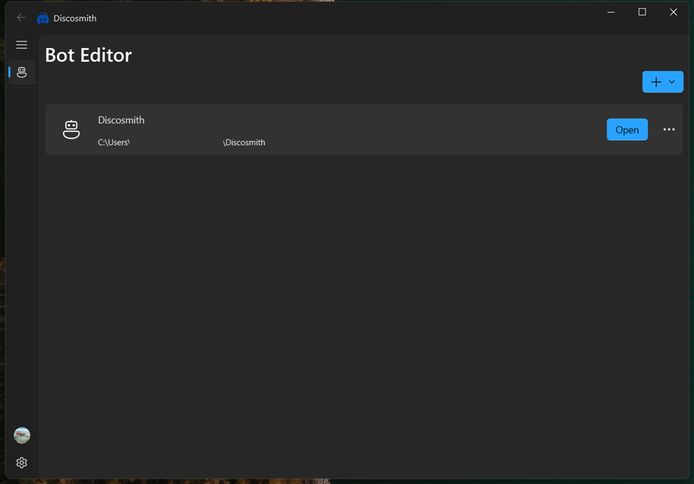

# Discosmith

Discosmith is a FluentUI based Discord Bot Maker App. You can use it to build discord bots without needing to know how to code. Just toggle the switches for the features you want, compile the bot, and deploy it locally or on other hosting sites. Built using qfluentwidgets and PySide6.

It comes with 15+ commands, including welcomer, AI chat, music, mod commands, etc.



## How to use

1. Download the latest zip of app from the releases. Then unzip it to your desired folder.

2. Once you open the app, you will be redirected to login using your discord account.

3. Once in, click on the `Add` button on the top right of the page.

4. Enter your bot name and bot token in the pop-up messages. Get your bot token from the [Discord Developers Portal](https://discord.com/developers/applications/).

5. Toggle the switch buttons to enable or disable specific features in the app.

6. To compile the bot into a standalone python file, click on the `Compile` button situated on the top right.

7. To deploy the bot, either locally or on a hosting platform, click on `Deploy`.

> To deploy locally, make sure you install the required modules from the `requirements.txt` file.
> To stop the local deployment, use the shortcut `Ctrl+Q`.

That's it! You just built your first bot using Discosmith!

-----

## Run the app locally

To run the app locally,

- Clone this repository locally

```bash
git clone https://github.com/jonathan4e/Discosmith.git
```

- Install all the nessecary modules from `requirements.txt`.

```bash
pip install --r requirements.txt
```

- Run `main.py`

- Follow the other steps in "How to use" to continue.

## AI Usage

I did use Google Gemini to help me build the OAuth functionality of the app, and help in debugging some major issues that I wasn't able to solve.

## Credits

Special thanks to stackoverflow and qfluentwidgets docs for massively helping me in this project, and to learn new things that I never knew before.

## LICENSE

This project is licenced under the MIT License. See [LICENSE](LICENSE)
